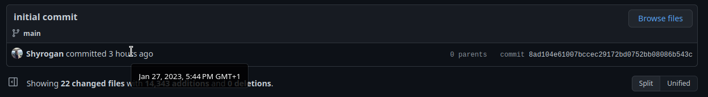

# Project

Started at around 5:10pm. I realized it would have been a good idea to create a repo directly when I started to keep track of time.  
My apologies for this. I committed slightly after starting the project (there was only the welcome page on the initial commit [#8ad104e](https://github.com/Shyrogan/myeasyfarm-test/commit/8ad104e61007bccec29172bd0752bb08086b543c)).  
I was done at around 8:15 for the main features. Time elapsed: 3:05 (breaks included).  

You can see exact commit hours by hovering on the date of a commit (or relative time):   

## Issues I had

Understanding the JSON was a little hard at first. `1-soilmaps.json` is a little odd at first and searching through them using `filter` is a little inefficient.  
It was my first time using `react-leaflet` (not `leaflet` itself) so the code might be unconventional. I apologize for this and did my best to keep it clean.

## Technologies used

- `tailwindcss` to avoid writing css files  
- `react-router-dom` to create routes in the application  
- `leaflet` and `react-leaflet` for the map  